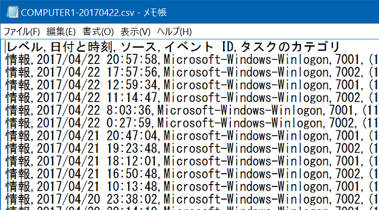

# Tools 2017
The project to create tools.

## Event Log Picker
Event Log Picker is a command line tool to pick out event log entries from a Windows PC.
By the app, a CSV file that follows the same format as exported by the Event Viewer will be created.  
See [document](https://github.com/sakapon/Tools-2017/wiki/Event-Log-Picker).

## Connective Bot
"Creativity is just connecting things." --- Steve Jobs  
Connective Bot is a Twitter bot that will compose words at random from the Wikipedia.  
[@bot_connective](https://twitter.com/bot_connective)

